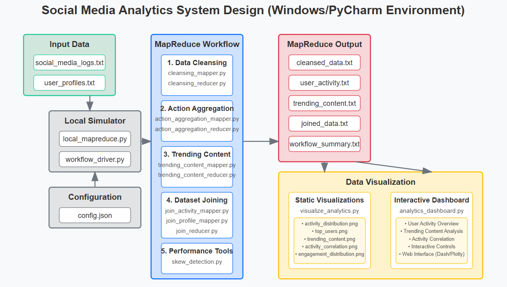

# Social Media Analytics MapReduce Workflow

This repository contains a comprehensive MapReduce workflow for analyzing social media data. The solution processes two datasets: `social_media_logs.txt` and `user_profiles.txt` to extract user activity patterns, identify trending content, and produce comprehensive analytics by joining the datasets.

## System Overview

The system consists of five main components:

1. **Data Cleansing and Parsing** - Extracts and validates fields from the raw data
2. **Action Aggregation and Sorting** - Aggregates user actions and sorts by post count
3. **Trending Content Identification** - Identifies popular content based on engagement
4. **Dataset Joining** - Combines user activity with profile information
5. **Data Visualization** - Provides insights through static and interactive visualizations

## System Architecture



The workflow follows a pipeline architecture:
- Input data is processed by the MapReduce simulator
- Each MapReduce job produces output that feeds into subsequent jobs
- Final outputs are used for visualization and analysis

## Prerequisites

For Windows/PyCharm setup:
- Windows operating system
- Python 3.6+
- PyCharm IDE (Community or Professional)
- Required Python libraries: numpy, psutil, matplotlib, pandas, dash, plotly, scipy

## Project Structure

```
social_media_analytics/
├── config.json                   # Configuration file
├── README.md                     # This file
│
├── data/                         # Input data directory
│   ├── social_media_logs.txt     # Social media logs dataset
│   └── user_profiles.txt         # User profiles dataset
│
├── output/                       # Output directory (created automatically)
│   ├── cleansed_data.txt         # Output from data cleansing job
│   ├── user_activity.txt         # Output from action aggregation job
│   ├── trending_content.txt      # Output from trending content job
│   ├── skew_analysis.json        # Output from skew detection
│   ├── joined_data.txt           # Output from join job
│   └── workflow_summary.txt      # Summary of workflow execution
│
├── src/                          # Source code directory
│   ├── cleansing_mapper.py       # Data cleansing mapper
│   ├── cleansing_reducer.py      # Data cleansing reducer
│   ├── action_aggregation_mapper.py    # Action aggregation mapper
│   ├── action_aggregation_reducer.py   # Action aggregation reducer
│   ├── trending_content_mapper.py      # Trending content mapper
│   ├── trending_content_combiner.py    # Trending content combiner
│   ├── trending_content_reducer.py     # Trending content reducer
│   ├── social_media_analytics_driver.py    # Workflow orchestration script
│   ├── join_activity_mapper.py    # Join activity data mapper
│   ├── join_profile_mapper.py     # Join profile data mapper
│   ├── join_reducer.py            # Join reducer
|   ├── visualize_analytics.py     # Static visualization generator
│   ├── analytics_dashboard.py     # Interactive dashboard application
│   ├── skew_detection.py          # Utility for detecting data skew
│   └── memory_monitor.py          # Utility for monitoring memory usage
│
└── visualizations/               # Visualization tools
    
```

## Quick Start

1. **Clone or download this repository**

2. **Install dependencies**
   ```
   pip install numpy psutil matplotlib pandas dash plotly scipy
   ```
3. **Unzip the following files as git does not allow files more than 100MB to be uploaded**
    ```
    social_media_logs.zip
    cleansed_data.zip
    ```
3. **Run the complete workflow**
   ```
   python social_media_analytics_driver.py --config config.json
   ```

4. **Generate visualizations**
   ```
   python visualize_analytics.py --input-dir output --output-dir visualizations
   ```

5. **Launch the interactive dashboard**
   ```
   python analytics_dashboard.py
   ```

## Components in Detail

### 1. Data Cleansing and Parsing

This component processes the raw `social_media_logs.txt` file:
- Parses tab-separated records extracting Timestamp, UserID, ActionType, ContentID, and Metadata
- Validates timestamps and JSON metadata
- Filters out malformed records
- Tracks discarded records using counters

Implementation:
- `cleansing_mapper.py` - Handles validation and filtering
- `cleansing_reducer.py` - Passes through valid records

### 2. Action Aggregation and Sorting

This component aggregates user actions by type:
- Counts posts, likes, comments, and shares for each user
- Sorts output by post count in descending order
- Uses composite keys for secondary sorting

Implementation:
- `action_aggregation_mapper.py` - Aggregates action counts per user
- `action_aggregation_reducer.py` - Formats output with proper sorting

### 3. Trending Content Identification

This component identifies popular content:
- Calculates engagement (likes + shares) for each content item
- Determines trending threshold based on the 90th percentile
- Handles potential data skew in popular content

Implementation:
- `trending_content_mapper.py` - Counts likes and shares per content
- `trending_content_combiner.py` - Performs local aggregation
- `trending_content_reducer.py` - Identifies trending content based on threshold

### 4. Dataset Joining

This component combines user activity with profile information:
- Joins user activity data with user profiles
- Implements a reduce-side join strategy
- Handles data skew for power users

Implementation:
- `join_activity_mapper.py` - Prepares activity data for joining
- `join_profile_mapper.py` - Prepares profile data for joining
- `join_reducer.py` - Performs the join operation
- `skew_detection.py` - Identifies and handles skewed keys

### 5. Data Visualization

This component provides analytics insights:
- Generates static visualizations of key metrics
- Provides an interactive dashboard for data exploration

Implementation:
- `visualize_analytics.py` - Creates static PNG visualizations
- `analytics_dashboard.py` - Provides web-based interactive dashboard

## Performance Optimizations

Several optimization techniques are implemented in the workflow:

### Code-Level Optimizations
1. **In-mapper combining** - Reduces intermediate data volume by aggregating in memory
2. **Efficient data structures** - Uses appropriate data structures for each task
3. **Secondary sort** - Ensures output is properly sorted without additional passes
4. **Combiners** - Implements combiners for local aggregation before shuffle

### System-Level Optimizations
1. **Skew detection** - Identifies and handles skewed keys to balance workload
2. **Memory monitoring** - Tracks resource usage during execution
3. **Dynamic reducers** - Configures the number of reducers based on data volume

## Running Individual Components

You can run individual MapReduce jobs for testing or debugging:

```
# Data cleansing only
python local_mapreduce.py --job cleansing --input-dir data --output-dir output

# Action aggregation only
python local_mapreduce.py --job aggregation --input-dir output --output-dir output

# Trending content only
python local_mapreduce.py --job trending --input-dir output --output-dir output

# Join operation only
python local_mapreduce.py --job join --input-dir output --output-dir output
```

## Visualization Tools

### Static Visualizations

The `visualize_analytics.py` script generates several visualization files:

- `activity_distribution.png` - Pie chart showing the distribution of different activity types
- `top_users.png` - Bar chart showing the most active users
- `trending_content.png` - Bar chart of the top trending content items
- `activity_correlation.png` - Heatmap showing correlations between different activity types
- `engagement_distribution.png` - Histogram of content engagement scores

Run with:
```
python visualize_analytics.py --input-dir output --output-dir visualizations
```

### Interactive Dashboard

The `analytics_dashboard.py` provides a web interface with:

- User Activity Overview
- Trending Content Analysis
- Activity Correlation Analysis
- Interactive controls for data exploration

Run with:
```
python analytics_dashboard.py
```
Then open your web browser to http://127.0.0.1:8050/

## Troubleshooting

If you encounter issues:

1. **Check file paths** - Ensure all paths in config.json are correct
2. **Verify input data format** - Make sure your data files match the expected format
3. **Check Python environment** - Ensure all required packages are installed
4. **Review logs** - Check workflow.log for detailed error messages
